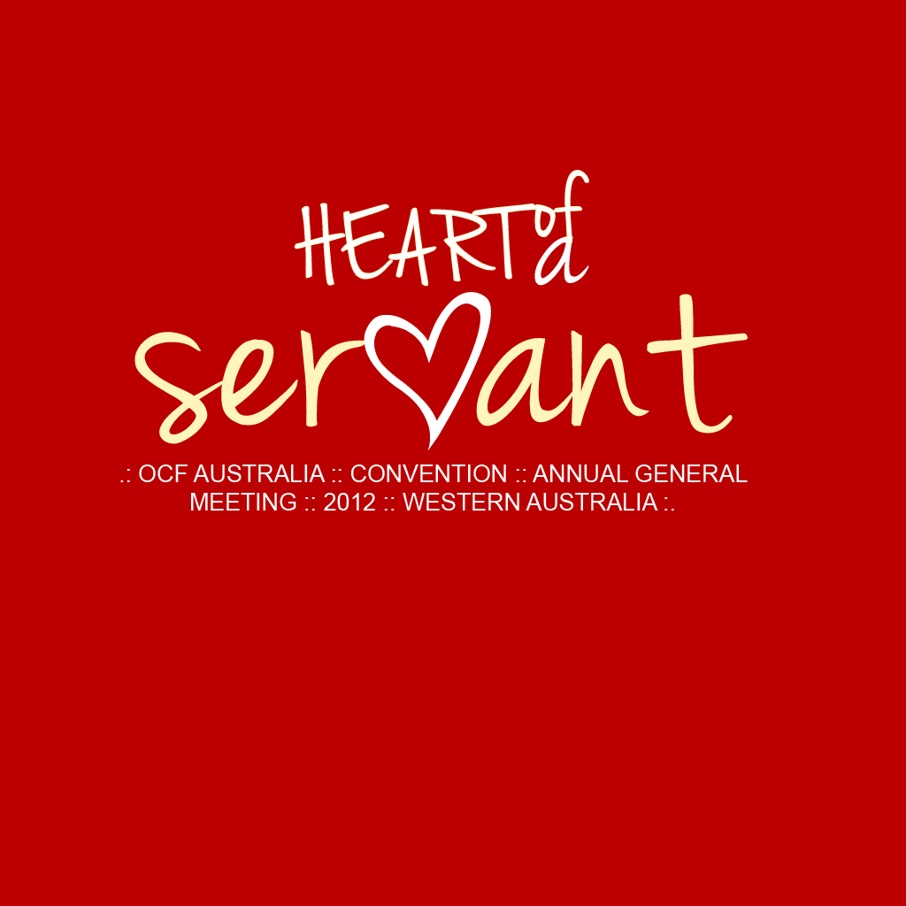
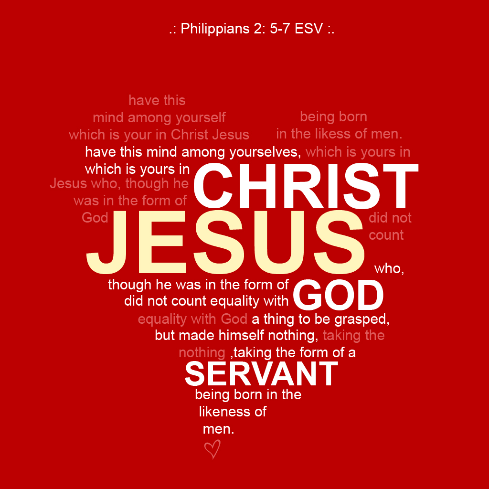

```{r setup, include=FALSE}
knitr::opts_chunk$set(echo = FALSE, warning = FALSE)
library(knitr)
```

A lazy person.

Didn't realise I like red just as much as blue.

### My ninja report {.tabset}

Here is my showcase.

#### 1

Kick ass 3D graph. Dimension is not working properly :(

<iframe height="500" src="https://plot.ly/~william.q.lim/257.embed"></iframe>

#### 2

T-shirt design for a student activity, 2012. Front. Font credit goes to [Jenna Sue](https://www.dafont.com/jenna-sue.font).
```{r, out.width="100%", fig.align='center'}

```

#### 3

T-shirt design for a student activity, 2012. Back.
```{r, out.width="100%", fig.align='center'}

```

#### 4

Nothing more to show. So. here is my favourite artist.

<iframe src="https://www.youtube.com/embed/HVbDD-IoHcU?showinfo=0" height="500" allowfullscreen>
</iframe>