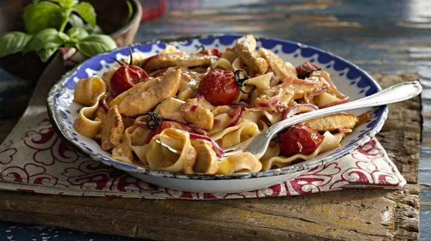

```{r setup, include=FALSE}
knitr::opts_chunk$set(echo = FALSE, warning = FALSE)
library(knitr)
```

# Personal recipe repository
A quick compilation of my favour recipes. Sourced from various places. No copyright infringement intended.

***

## Easy sausage carbonara
Serve 1.

### Ingredients
  - 150 g dried tagliatelle
  - 3 higher-welfare sausages
  -	1/2 a bunch of fresh flat-leaf parsley (15g)
  -	1 large free-range egg
  -	30 g Parmesan cheese

### Method
1. Cook the pasta in a pan of boiling salted water according to the packet instructions, then drain, reserving a mugful of cooking water. Meanwhile, squeeze the sausage meat out of the skins, then, with wet hands, quickly shape into 18 even-sized balls. Roll and coat them in black pepper, then cook in a non- stick frying pan on a medium heat with 1/2 a tablespoon of olive oil until golden and cooked through, tossing regularly, then turn the heat off.

2. Finely chop the parsley, stalks and all, beat it with the egg and a splash of pasta cooking water, then finely grate and mix in most of the Parmesan.

3. Toss the drained pasta into the sausage pan, pour in the egg mixture, and toss for 1 minute off the heat (the egg will gently cook in the residual heat). Loosen with a good splash of reserved cooking water, season to perfection with sea salt and pepper, and finely grate over the remaining Parmesan. 

### Source

Jamie Oliver 5 Ingredients

2018. Replace the cheating Bolognese from the original 3 (2011-2013).


<a href="#top">Back to top</a>

***

## Three cup chicken

<!-- ```{r, out.width="100%", fig.align='center'} -->
<!-- include_graphics("images//threecupchicken.jpg") -->
<!-- ``` -->

### Ingredients
  -	1 lb chicken drumsticks
  -	1 tablespoon baking soda, to tenderize the chicken, optional
  -	2 tablespoons dark sesame oil or toasted sesame oil
  -	2-inch piece old ginger, peeled and cut into thin pieces
  -	6 cloves garlic, peeled
  -	1 1/2 tablespoons soy sauce
  -	1 1/2 tablespoons dark sweet soy sauce (kecap manis)
  -	1 1/2 tablespoons Shaoxing wine
  -	A big bunch Thai basil leaves

### Method
1. Cut the chicken into pieces and rub them with the baking soda. Set aside for 10 minutes before rinsing the chicken off with water. Make sure the baking soda is completely rinsed off. Pat dry the chicken pieces and set aside.

2. Heat up a claypot on high heat and add the dark sesame oil. Add the ginger, garlic, and stir-fry until aromatic. Add in the chicken and do a few quick stirs. Add the soy sauce, dark sweet soy sauce, Shaoxing wine and continue to stir-fry the chicken. Cover the chicken and lower the heat and simmer for 5-10 minutes. Add the basil leaves and stir well with the chicken, dish out and serve immediately.

### Cook's Notes
1. This recipe calls for dark sesame oil or toasted sesame oil, which is different from regular sesame oil. Dark sesame oil is a lot more expensive but the flavor is more intense and with a stronger toasted sesame fragrance.
2. 	You can skip the first step of tenderizing the chicken with baking soda. I personally like it because it makes the chicken so tender.
3. If you don’t have a claypot, you can use a regular wok or pan to make this dish.


### Source
http://rasamalaysia.com/three-cups-chicken-recipe/2/

Part of the original 3 (2011-2013). Inherited from a friend, Ming.

<a href="#top">Back to top</a>

***

## Bok Choy chicken


### Ingredients
  -	6 oz boneless and skinless chicken breast, cut into thin pieces
  -	2 tablespoons oil
  -	8 oz bok choy, sliced into pieces
  -	1 inch piece ginger, peeled and sliced into pieces

### Marinade
  -	1/2 tablespoon soy sauce
  -	1/2 tablespoon cornstarch

### Sauce
  -	1/2 heaping tablespoon oyster sauce
  -	2 tablespoons water
  -	1/4 teaspoon sesame oil
  -	3 dashes white pepper
  -	1 teaspoon wine
  -	1/2 teaspoon sugar


### Method
1. Marinate the chicken with the ingredients in Marinade for 10 minutes. Combine all the ingredients in the Sauce in a small bowl, stir to blend well.
2. Heat 1/2 tablespoon oil in a wok until the oil becomes hot. Add the chicken and quickly stir-fry until the surface of the chicken turn opaque or white. Dish out and set aside. This step seals in the juice in the chicken so the texture is tender and velvety smooth.
3. Heat up the remaining oil in the wok until hot. Add the ginger into the wok and stir-fry until aromatic. Add the chicken back into the wok and do a few quick stirs. Add in the bok choy and stir to combine well. Transfer the sauce into the wok and continue to stir-fry until the bok choy is cooked but remain crisp. Do not overcook.
4. Dish out and serve immediately with steamed white rice.

### Source

http://rasamalaysia.com/ginger-and-scallion-fish-recipe/2/

Part of the original 3 (2011-2013). Inherited from a friend, Ming.

<a href="#top">Back to top</a>

***

## Ginger and shallot chicken, beef or fish

### Ingredients
  -	8 oz beef flap meat, beef tenderloin or beef flank steak, sliced
  -	2 tablespoons oil
  -	inch ginger, peeled and thinly shredded
  -	3 stalks scallions, cut into 2-inch lengths
  -	1 teaspoon cornstarch

### Sauce
  -	1 tablespoon oyster sauce
  -	1 teaspoon Maggi seasoning
  -	1 teaspoon sesame oil
  -	4 tablespoons water
  -	1 teaspoon cornstarch
  -	1/2 tablespoons dry Sherry or Shaoxing wine, optional
  -	1 teaspoon sugar
  -	1/2 teaspoon salt
  -	3 dash white pepper powder

### Method
1. Marinate sliced beef with the cornstarch for 10 minutes. Combine all the Sauce ingredients, mix well and set aside.
2. In a wok, heat up the oil until very high heat, stir-fry shredded ginger until fragrant. Toss in beef slices and continue to stir-fry for a few minutes, or until beef is cooked. Add in the Sauce and stir-fry a couple of times or until the sauce thickens. All scallions, stir dish out and serve with steamed rice.

### Source
http://rasamalaysia.com/ginger-and-scallion-fish-recipe/2/

First venture. 2015.

<a href="#top">Back to top</a>

***

## Creamy Peri-peri chicken pasta (fettuccini)

```{r, out.width="100%", fig.align='center'}

```

Serve 4.

### Ingredients
-	5 tsp Olive oil
-	1 Red onion, peeled, halved and sliced
-	2 Garlic cloves, crushed
-	500g Chicken fillets, thinly sliced
-	1/3 Cup (60ml) Nando's PERi-PERi Sauce
-	1 Cup (250ml) cream
-	250g Oven-roasted cherry tomatoes
-	Salt and freshly milled black pepper
-	500g Cooked pasta, such as, fettuccini, tagliatelle or papparadelle

### Directions
1.	Heat the oil in a wok or wide frying pan. Add the onion and fry for 3-4 minutes. Stir in the garlic and fry for 1 minute. 
2.	Add the chicken strips and stir fry on a high heat, for 3-5 minutes, to brown the chicken.
3.	Stir in the Nando's PERi-PERi sauce and simmer for 1 minute, to reduce slightly.
4.	Stir in the cream and oven-roasted tomatoes and simmer for 5 minutes. Season with salt and pepper.
5.	Ladle over pasta and serve.

### Source

http://www.nandos.com.au/recipes/recipe/detail?id=1128

A friend's R birthday at 2016.

<a href="#top">Back to top</a>

## Ying's Emperor chicken rice

Serve 4.

### Rice
  -	4-small cup Jasmin rice
  -	A handful of black bean (optional)

### Chicken and marinade
  -	500g chicken thigh fillet (diced into 2cm cubes)
  -	Shao Xing wine
  -	Ginger finely diced (or grated)
  -	Soy sauce
  -	Dark soy sauce (optional)

### Pack 1
  -	7 Shiitaki mushroom
  -	7 Chinese red dates

### Pack 2
  -	Handful of goji berries
  -	Handful of black fungus

### Method
1.	Night before or hours before: Immerse the black bean, Shiitake mushroom and red dates in water, keep the water
2.	Wash and cook the rice (add water from Step 1)
3.	Dice ginger
4.	Dice the chicken thighs and marinade it
5.	Clean up and cut Pack 1 into strips
6.	Put the chicken and Pack 1 into the rice cook (the rice should be 1/3 to half cooked now)
7.	Clean up the remaining
8.	Put Pack 2 into the rice cooker

### Source

A friend. Ying. Housewarming at 2017.

<a href="#top">Back to top</a>

***

## To do list

1. Update the serving size and change the quantity unit to metric system.
2. 2018 dish - Ginger beef
    - https://www.hellofresh.com.au/recipes/ginger-beef-stir-fry-5786ed37b2baafc45b8b4568
3. 2018 dish
